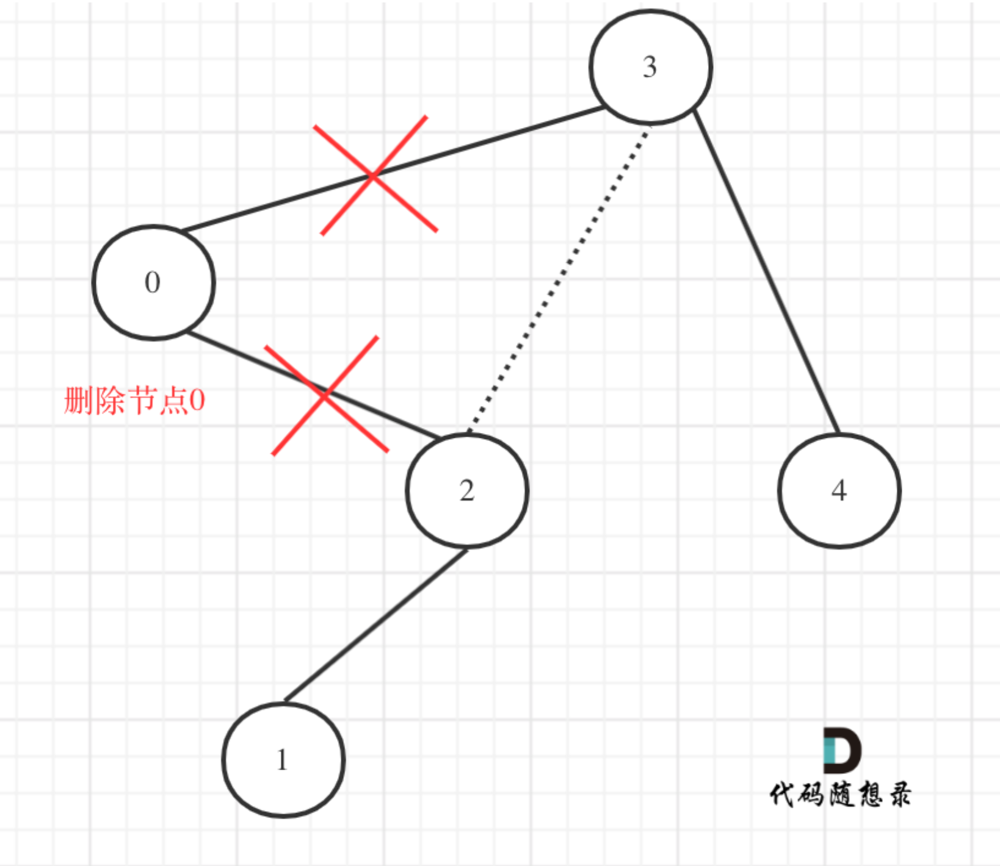

#codepratice-day18
代码随想录第十八次练习

这次练习做了6天，原因主要是总结部分，回顾了之前的二叉树内容，重打了一些题。比如 二叉树的最近公共祖先、二叉搜索树中的众数、 验证二叉搜索树、二叉搜索树中的搜索等等，挺多的。

这次的内容为三题
[修剪二叉搜索树](https://leetcode.cn/problems/trim-a-binary-search-tree/description/)
给你二叉搜索树的根节点 root ，同时给定最小边界low 和最大边界 high。通过修剪二叉搜索树，使得所有节点的值在[low, high]中。修剪树 不应该 改变保留在树中的元素的相对结构 (即，如果没有被移除，原有的父代子代关系都应当保留)。 可以证明，存在 唯一的答案 。

所以结果应当返回修剪好的二叉搜索树的新的根节点。注意，根节点可能会根据给定的边界发生改变。


不能在节点值超出区间值就直接返沪null，因为区间在二叉搜索树中不是单纯的节点3和左孩子0可以决定的，还需要考虑节点0的右子树。
在发现节点0不符合区间要求，那么将节点0的右孩子 节点2 直接赋给 父节点3的左孩子，即可。
如图：


理解了关键部分，开始递归三部曲
1.确定递归函数的参数以及返回值
有返回值更方便，可以通过递归函数的返回值来移除节点。

2.确定终止条件
修剪操作不是在终止条件上进行的，所以遇到空节点返回就可以了。

3.确定单层递归的逻辑
如果 当前节点 的元素小于low，那么应该递归右子树，并返回右子树符合条件的头结点。

如果 当前节点 的元素大于high，那么应该递归左子树，并返回左子树符合条件的头结点。

把节点0的右孩子（节点2）返回给上一层：
```CPP
if (root->val < low) {
    TreeNode* right = trimBST(root->right, low, high); // 寻找符合区间[low, high]的节点
    return right;
}
```

用节点3的左孩子 把下一层返回的 节点0的右孩子（节点2）接住。
```CPP
root->left = trimBST(root->left, low, high);
```

整体代码：
```CPP
class Solution {
public:
    TreeNode* trimBST(TreeNode* root, int low, int high) {
        if (root == nullptr ) return nullptr;
        if (root->val < low) {
            TreeNode* right = trimBST(root->right, low, high); // 寻找符合区间[low, high]的节点
            return right;
        }
        if (root->val > high) {
            TreeNode* left = trimBST(root->left, low, high); // 寻找符合区间[low, high]的节点
            return left;
        }
        root->left = trimBST(root->left, low, high); // root->left接入符合条件的左孩子
        root->right = trimBST(root->right, low, high); // root->right接入符合条件的右孩子
        return root;
    }
};
```

精简：
```CPP
class Solution {
public:
    TreeNode* trimBST(TreeNode* root, int low, int high) {
        if (root == nullptr) return nullptr;
        if (root->val < low) return trimBST(root->right, low, high);
        if (root->val > high) return trimBST(root->left, low, high);
        root->left = trimBST(root->left, low, high);
        root->right = trimBST(root->right, low, high);
        return root;
    }
};
```

迭代法：
由于二叉搜索树有序性，不需要用栈模拟递归的过程。

剪枝时分三步
1.将root移动到[l,r]范围内，注意时左闭右闭区间
2.剪枝左子树
3.剪枝右子树

```CPP
class Solution {
public:
    TreeNode* trimBST(TreeNode* root, int L, int R) {
        if (!root) return nullptr;

        // 处理头结点，让root移动到[L, R] 范围内，注意是左闭右闭
        while (root != nullptr && (root->val < L || root->val > R)) {
            if (root->val < L) root = root->right; // 小于L往右走
            else root = root->left; // 大于R往左走
        }
        TreeNode *cur = root;
        // 此时root已经在[L, R] 范围内，处理左孩子元素小于L的情况
        while (cur != nullptr) {
            while (cur->left && cur->left->val < L) {
                cur->left = cur->left->right;
            }
            cur = cur->left;
        }
        cur = root;

        // 此时root已经在[L, R] 范围内，处理右孩子大于R的情况
        while (cur != nullptr) {
            while (cur->right && cur->right->val > R) {
                cur->right = cur->right->left;
            }
            cur = cur->right;
        }
        return root;
    }
};
```


[将有序数组转换为二叉搜索树](https://leetcode.cn/problems/convert-sorted-array-to-binary-search-tree/)
给你一个整数数组 nums ，其中元素已经按 升序 排列，请你将其转换为一棵 
平衡二叉搜索树。

做这道题之前，先过了几道题目。

这道题如果不限制平衡二叉树，那么就可以用线性方式构造二叉树，就没意义了。

如何根据数组构造一棵二叉树： 本质是寻找分割点，分割点作为当前节点，然后递归左区间和右区间

递归三部曲
1.确定递归函数返回值以及参数
用递归函数的返回值来构造中节点的左右孩子
参数，传入数组，接着是左下标和右下标，尽量不要重新定义左右区间数组，而是用下标来操作原数组。

坚持左闭右闭，在不断分割过程中。  循环不变量。

2.确定递归终止条件
如果left>right，就是空节点。

3.确定单层递归的逻辑
首先取数组中间元素的位置，int mid=(left+right)/2；但是这样写可能数组越界，即left和right都是最大int,
所以一般int mid=left+((right-left)/2);

取到中间位置，就开始以中间位置的元素构造节点。


