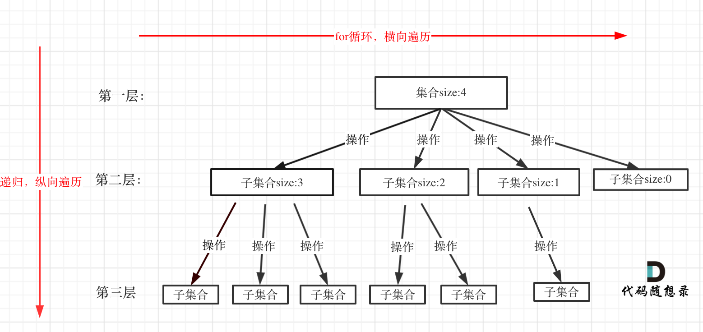

# codepratice-day19

代码随想录第十九次练习

回溯算法，原理。组合问题。

回溯法原理：
回溯的本质是穷举。

回溯法可以解决：
组合
切割
子集
排列
棋盘

组合不强调元素顺序，排列强调元素顺序。

回溯法解决的问题都可以抽象为树形结构。
集合的大小构成了树的宽度，递归的深度构成了树的深度。

回溯三部曲
1.回溯函数返回值以及参数
边写边考虑需要什么参数。
void backtracking(参数)

2.回溯函数终止条件
一般搜索到叶子节点，就找到了满足条件的一个答案，保存并结束本层递归。

if(终止条件)
{
    存放结果；
    return;
}

3.回溯搜索的遍历过程
回溯法一般是在集合中递归搜索，集合的大小构成了树的宽度，递归的深度构成的树的深度。


伪代码：
for(选择：本层集合中元素（树种节点孩子的数量就是集合的大小)）
{
    处理节点;
    backtracking(路径，选择列表);//递归
    回溯，撤销处理结果
}

for循环可以理解是横向遍历，backtracking（递归）就是纵向遍历

回溯算法模板框架如下：（重点！！！！）
void backtracking(参数)
{
    if(终止条件)
    {
        存放结果;
        return ;
    }

    for(选择：本层集合中元素（树种节点孩子的数量就是集合的大小)）
    {
        处理节点;
        backtracking(路径，选择列表);//递归
        回溯，撤销处理结果
    }
}

[组合](https://leetcode.cn/problems/combinations/description/)
给定两个整数 n 和 k，返回范围 [1, n] 中所有可能的 k 个数的组合。
你可以按 任何顺序 返回答案。

k有几个，就需要几个for循环，但是暴力写不出来。

递归来做层叠嵌套，每一次的递归中嵌套一个for循环，递归就可以解决多层嵌套循环问题了。

回溯法解决的问题都可以抽象为树形结构（N叉树），用树形结构来理解回溯就容易多了

回溯三部曲
1.递归函数的返回值以及参数
全局遍历存放单一结果和结果集合。

两个参数，n,k。然后需要startindex，记录本层递归从哪里开始遍历，防止出现重复的组合。

2.回溯函数的终止条件
如果path的大小到达k，就找到一个子集大小为k的组合了。把path保存起来，结束递归。

3.单层搜索的过程
for循环用来横向遍历，递归过程是纵向遍历。

```CPP
class Solution {
private:
    vector<vector<int>> result; // 存放符合条件结果的集合
    vector<int> path; // 用来存放符合条件结果
    void backtracking(int n, int k, int startIndex) {
        if (path.size() == k) {
            result.push_back(path);
            return;
        }
        for (int i = startIndex; i <= n; i++) {
            path.push_back(i); // 处理节点
            backtracking(n, k, i + 1); // 递归
            path.pop_back(); // 回溯，撤销处理的节点
        }
    }
public:
    vector<vector<int>> combine(int n, int k) {
        result.clear(); // 可以不写
        path.clear();   // 可以不写
        backtracking(n, k, 1);
        return result;
    }
};

```

[组合总和III](https://leetcode.cn/problems/combination-sum-iii/description/)
找出所有相加之和为 n 的 k 个数的组合，且满足下列条件：

只使用数字1到9
每个数字 最多使用一次 

返回 所有可能的有效组合的列表 。该列表不能包含相同的组合两次，组合可以以任何顺序返回。

回溯三部曲
1.确定递归函数参数

存放结果集和符合条件的结果
还需要 目标和，k个数，已经收集元素和sum，为下一场for循环搜索的起始位置。

2.确定终止条件
path.size()与K相等就终止，且满足条件。

3.单层搜索过程
固定9个数，收集满足的元素总和
sum有加有减（回溯）

```CPP
class Solution {
private:
    vector<vector<int>> result; // 存放结果集
    vector<int> path; // 符合条件的结果
    // targetSum：目标和，也就是题目中的n。
    // k：题目中要求k个数的集合。
    // sum：已经收集的元素的总和，也就是path里元素的总和。
    // startIndex：下一层for循环搜索的起始位置。
    void backtracking(int targetSum, int k, int sum, int startIndex) {
        if (path.size() == k) {
            if (sum == targetSum) result.push_back(path);
            return; // 如果path.size() == k 但sum != targetSum 直接返回
        }
        for (int i = startIndex; i <= 9; i++) {
            sum += i; // 处理
            path.push_back(i); // 处理
            backtracking(targetSum, k, sum, i + 1); // 注意i+1调整startIndex
            sum -= i; // 回溯
            path.pop_back(); // 回溯
        }
    }

public:
    vector<vector<int>> combinationSum3(int k, int n) {
        result.clear(); // 可以不加
        path.clear();   // 可以不加
        backtracking(n, k, 0, 1);
        return result;
    }
};
```

剪枝
如果元素总和大于n，就直接剪枝。
```CPP
if(sum>targetSum)
{
    return ;
}
```
剪枝整体代码
```CPP

class Solution {
private:
    vector<vector<int>> result; // 存放结果集
    vector<int> path; // 符合条件的结果
    void backtracking(int targetSum, int k, int sum, int startIndex) {
        if (sum > targetSum) { // 剪枝操作
            return; 
        }
        if (path.size() == k) {
            if (sum == targetSum) result.push_back(path);
            return; // 如果path.size() == k 但sum != targetSum 直接返回
        }
        for (int i = startIndex; i <= 9 - (k - path.size()) + 1; i++) { // 剪枝
            sum += i; // 处理
            path.push_back(i); // 处理
            backtracking(targetSum, k, sum, i + 1); // 注意i+1调整startIndex
            sum -= i; // 回溯
            path.pop_back(); // 回溯
        }
    }

public:
    vector<vector<int>> combinationSum3(int k, int n) {
        result.clear(); // 可以不加
        path.clear();   // 可以不加
        backtracking(n, k, 0, 1);
        return result;
    }
};
```

[电话号码的字母组合](https://leetcode.cn/problems/letter-combinations-of-a-phone-number/description/)
给定一个仅包含数字 2-9 的字符串，返回所有它能表示的字母组合。答案可以按 任意顺序 返回。

给出数字到字母的映射如下（与电话按键相同）。注意 1 不对应任何字母。


for循环的层数如何写出来。
1.数字和字母如何映射
2.两个字母就两个for循环，三个字符我就三个for循环，以此类推，然后发现代码根本写不出来
3.输入1 * #按键等等异常情况

数字和字母如何映射
使用map或者定义一个二维数组来做映射。

回溯三部曲：
1.确定回溯函数参数
一个字符串s来收集叶子节点的结果，然后用一个字符串数组result保存起来

参数有digits，还有index，记录遍历第几个数字了。

2.确定终止条件
index等于输入数字的个数。

3.确定单层递归逻辑
取index指向的数字，找到字符集，用for循环处理字符集。

```CPP
class Solution {
private:
    const string letterMap[10] = {
        "", // 0
        "", // 1
        "abc", // 2
        "def", // 3
        "ghi", // 4
        "jkl", // 5
        "mno", // 6
        "pqrs", // 7
        "tuv", // 8
        "wxyz", // 9
    };
public:
    vector<string> result;
    string s;
    void backtracking(const string& digits, int index) {
        if (index == digits.size()) {
            result.push_back(s);
            return;
        }
        int digit = digits[index] - '0';        // 将index指向的数字转为int
        string letters = letterMap[digit];      // 取数字对应的字符集
        for (int i = 0; i < letters.size(); i++) {
            s.push_back(letters[i]);            // 处理
            backtracking(digits, index + 1);    // 递归，注意index+1，一下层要处理下一个数字了
            s.pop_back();                       // 回溯
        }
    }
    vector<string> letterCombinations(string digits) {
        s.clear();
        result.clear();
        if (digits.size() == 0) {
            return result;
        }
        backtracking(digits, 0);
        return result;
    }
};

```
回溯放在递归函数中
```CPP
class Solution {
private:
        const string letterMap[10] = {
            "", // 0
            "", // 1
            "abc", // 2
            "def", // 3
            "ghi", // 4
            "jkl", // 5
            "mno", // 6
            "pqrs", // 7
            "tuv", // 8
            "wxyz", // 9
        };
public:
    vector<string> result;
    void getCombinations(const string& digits, int index, const string& s) { // 注意参数的不同
        if (index == digits.size()) {
            result.push_back(s);
            return;
        }
        int digit = digits[index] - '0';
        string letters = letterMap[digit];
        for (int i = 0; i < letters.size(); i++) {
            getCombinations(digits, index + 1, s + letters[i]);  // 注意这里的不同
        }
    }
    vector<string> letterCombinations(string digits) {
        result.clear();
        if (digits.size() == 0) {
            return result;
        }
        getCombinations(digits, 0, "");
        return result;

    }
};
```
代码随想录的视频讲解其实也可以看看。


